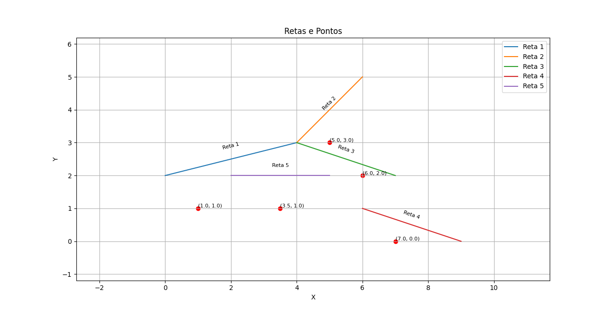
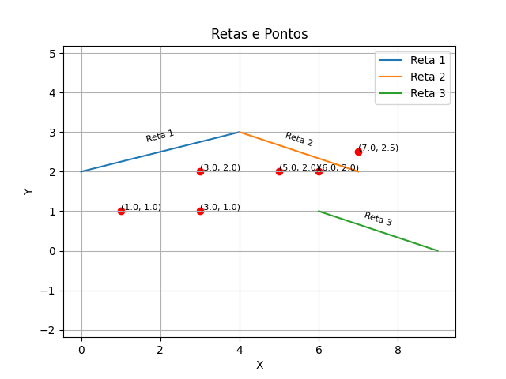
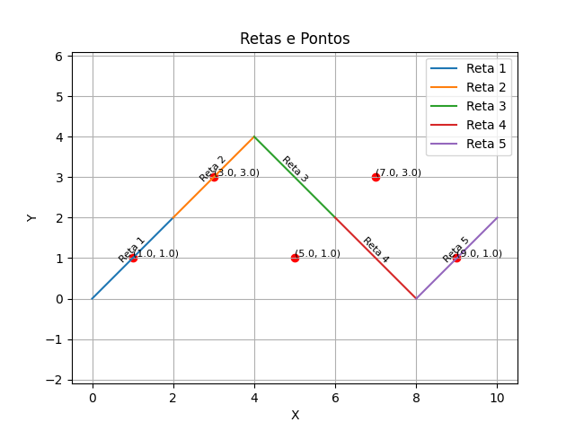
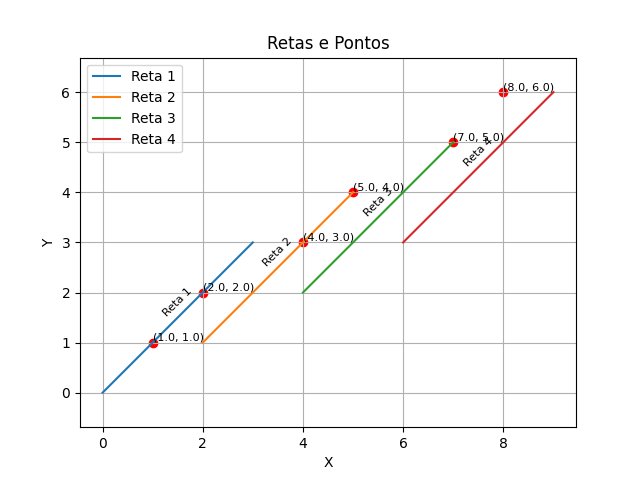
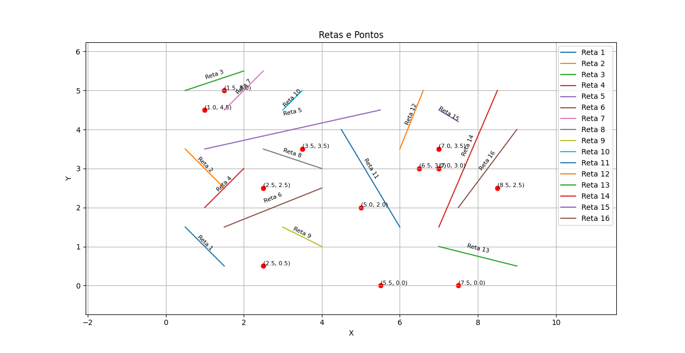
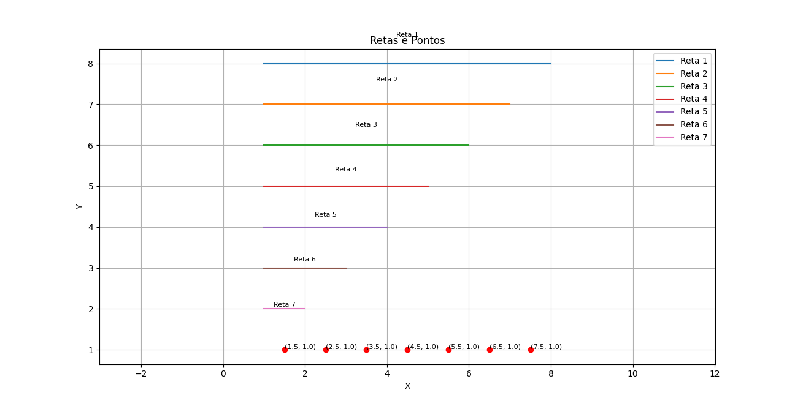
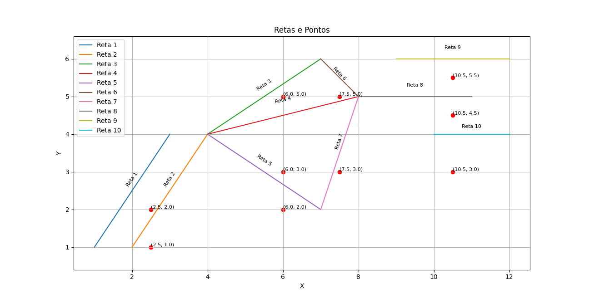

# Árvore Rubro-Negra parcialmente persistente para a solução do problema do raio vertical

1. Como compilar:

```
gcc arn_2p.c -o arn_2p -lm
```

2. Como executar:

```
Uso: ./arn_2p <input_file> <boolean_debug>

Examplos: 
    ./arn_2p exemplo_io_1.txt
    ./arn_2p exemplo_io_1.txt 0
    ./arn_2p exemplo_io_1.txt 1
```

3. Passos para a resolução do problema:

- 1º Passo: Implementação de uma Árvore Rubro-Negra, optando pela Árvore Rubro-Negra Caída para a Esquerda.
    ```
    struct no {
        struct reta*   key;
        struct no*     esq;
        struct no*     dir;
        Cor            cor;

        Mod*           mod[MAX_QM];
        int            qmods;
    };
    ```
    - Uso de uma estrutura de dados que represente a Árvore Rubro-Negra, sem o ponteiro para o pai, com um vetor de modificações, de tamanho máximo igual a 2.

- 2º Passo: Implementação da persistência. 
    ```
    typedef struct {
        int versao;
        Tipo tipo;
        void *ref;
    } Mod;
    ```
    - Uso de uma estrutura de dados onde é salva a versão de modificação;
    - Salva também o tipo da modificação;
    - Salva a referência para o valor da modificação.
    - A cada alteração feita na árvore durante a inserção ou remoção é criada uma nova modificação.

- 3º Passo: resolução de problema do raio vertical.
    - Algoritmo:
    ```
    1 - crio um vetor retas (N,4) com os valores das retas;
    
    2 - crio uma variavel xs, que salva todos os valores dos x (x1 e x2) de cada reta, de tamanho Nx2;
    
    3 - ordeno o vetor xs e removo os valores duplicados, agora tenho o começo dos intervalos;

    4 - executo um for dentro de um for, no for externo incremento um valor para acessar xs, e no for interno um valor para acessar as retas;
    
    5 - dentro dos for's:
        5.1 - crio uma variavel x que guarda o valor do meio do intervalo;

        5.2 - verifico se x está dentro da reta atual, x >= x1_retaAtual && x <= x2_retaAtual;
        
            5.2.1 - se sim e não tiver na arvore adiciono;
        
            5.2.2 - se não e tiver na arvore removo;
    
        5.3 - guardo a ultima versao da arvore no intervalo num vetor   intervalos;
    
    6 - crio um vetor pontos com os valores do pontos (N, 2) a serem consultados.

    7 - executo um for, cada interação é um ponto:
        7.1 -> procura em que intervalo está o ponto com um while;
        
        7.2 -> procuro o Sucesser(T, x1, y1, intervalo), intervalo é o valor referente a ultima versão da arvore dentro do intervalo;
        
        7.3 -> printo o numero da reta;
    ```

4. Exemplos de uso:

    - ./arn_2p exemplos/exemplo_io_1.txt

    

    - ./arn_2p exemplos/exemplo_io_2.txt

    

    - ./arn_2p exemplos/exemplo_io_3.txt

    

    - ./arn_2p exemplos/exemplo_io_4.txt

    

    - ./arn_2p exemplos/exemplo_io_5.txt

    

    - ./arn_2p exemplos/exemplo_io_6.txt

    

    - ./arn_2p exemplos/exemplo_io_7.txt

    